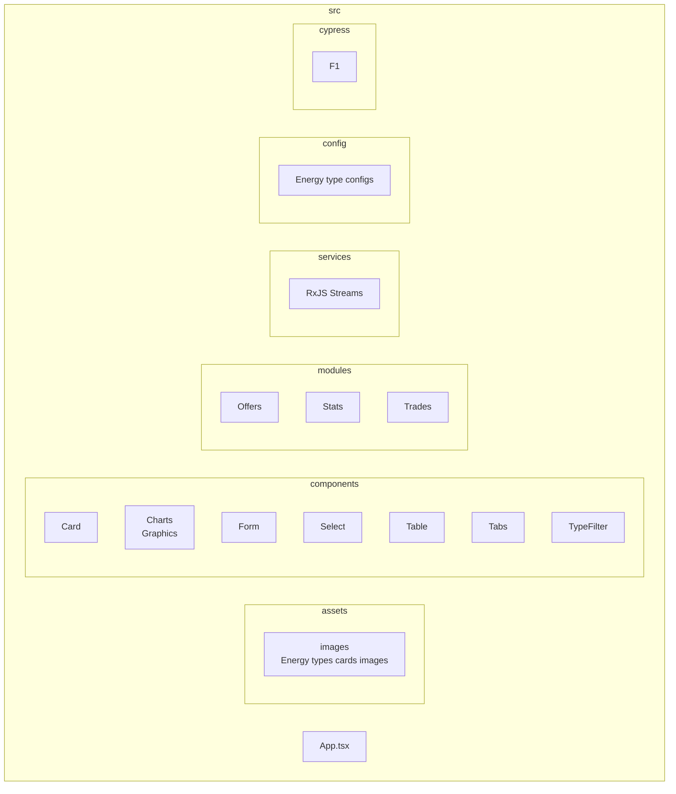

# React + TypeScript + Vite

### Install dependencies

```bash
yarn install
yarn run dev
```
---

# AxGrid – Architecture Overview

AxGrid is a dynamic front-end for energy trading, designed to handle multiple energy sources (solar, wind, gas, hydro, thermal, kinetic, etc.) with **real-time updates** and a **modular architecture**.

---

## 🔑 Key Idea

We follow a **modular architecture** with a clear separation of concerns.  
This ensures the platform can grow from a lightweight demo to a production-ready system without rewriting the core logic.

---

## 🏗️ Layers

### 1. **UI Layer (React)**

- Components handle only **presentation and user interaction**.
- Examples: `Table`, `Select`, `Form`.
- No business logic is stored here.

---

### 2. **State Management (Zustand)**

- Holds the global list of offers.
- Exposes simple actions:
  - `addOffer`
  - `updateOffer`
  - `confirmOffer`
- React components subscribe to the store to re-render automatically.

### 🤔 Why Zustand?

We use **Zustand** instead of Context or Redux because it’s lightweight, avoids unnecessary re-renders, and integrates seamlessly with real-time updates (RxJS/Socket.IO).  
It keeps AxGrid simple to build today while remaining scalable for future growth.

---

### 3. **Services (Infrastructure)**

- **RxJS Streams** simulate real-time updates (mocking WebSocket/Socket.IO).
- Later, these can be replaced by actual APIs or sockets without touching the UI.
- Also includes mock data providers (`mockOffers`).

---

### 4. **Domain (Business Rules)**

- Defines **types and interfaces** like `EnergyOffering` and `EnergyTypeConfig`.
- Encodes rules (e.g. _don’t update offers that are already confirmed_).
- Independent from React, Zustand, or RxJS.

---

## 📂 Project Structure Diagram



## Note:
- In the module Create Trade you can import a JSON file to complete all the form fields automatically (in the root folder there is a example of the file: offers.json)

## 🧪 Cypress Testing

The project includes comprehensive end-to-end (E2E) testing using **Cypress** to ensure the reliability and functionality of the energy trading platform.

### 🎯 Test Coverage

The E2E tests cover the following key functionalities:

#### **Offers Module Testing** (`Offers.cy.ts`)

- **Page Load & Component Visibility**
  - Verifies the offers page loads correctly
  - Ensures all main components (table, filters) are visible
  - Validates proper data structure display

- **Energy Type Filtering**
  - Tests all energy type filters: All, Solar, Wind, Gas, Hydro, Thermal, Kinetic
  - Verifies filtering functionality works correctly
  - Ensures filter state is maintained during interactions

- **Data Display & Validation**
  - Validates table headers and data structure
  - Tests specific mock data accuracy
  - Verifies proper formatting of prices, quantities, and terms

- **Offer Management**
  - Tests offer confirmation workflow
  - Validates status changes (Pending → Confirmed)
  - Ensures button states update correctly after confirmation

- **User Interactions**
  - Tests hover effects and info cards
  - Validates responsive behavior
  - Ensures graceful handling of edge cases

### 🚀 Running Tests

```bash
# Run all E2E tests
yarn cy:run
```

### 🔧 Test Configuration

- **Base URL**: `localhost:5173` (Vite development server)
- **Browser**: Default Cypress browser
- **Test Data**: Uses mock data from `src/store/mock.tsx`
- **Assertions**: Comprehensive validation of UI elements and data integrity

### 📊 Test Data Validation

The tests validate against the mock data structure:
- **10 mock offers** across different energy types
- **Price ranges**: €90-130/MWh
- **Contract terms**: 1-5 years
- **Payment methods**: Credit card, Wire transfer, Bank transfer
- **Capacity ranges**: 100-1200 MW

---
